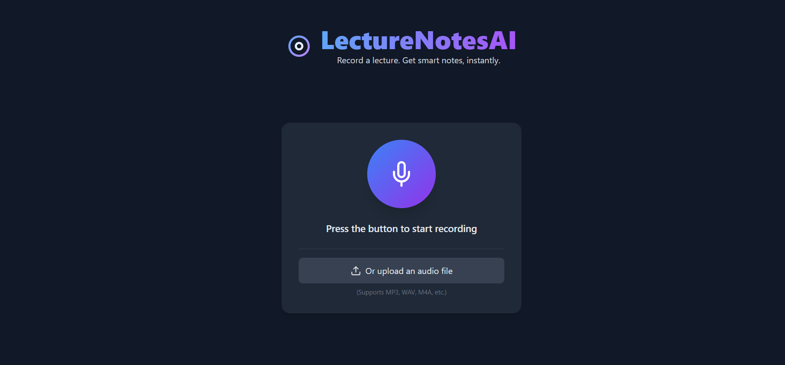

# LectureFlow - AI-Powered Lecture To Notes Converter

A modern, sleek web application that converts lecture audio into comprehensive study materials using AI.

Output:

## 🚀 Features

- **Audio Upload/Record**: Upload MP3, WAV, M4A, or OGG files (up to 100MB)
- **Speech-to-Text**: Convert audio to text using OpenAI Whisper API
- **AI Summarization**: Generate concise, student-friendly study notes using GPT-4
- **Quiz Generation**: Create 5 multiple-choice questions with explanations
- **Flashcards**: Generate 5 flashcards for key concepts
- **PDF Export**: Download notes and quizzes as PDF
- **Modern UI**: Clean, responsive design with micro-interactions
- **Progress Tracking**: Real-time processing indicators

## 🛠️ Installation

### Prerequisites
- Python 3.8 or higher
- OpenAI API key

### Setup

# Run and deploy your AI Studio app

View app in AI Studio: https://ai.studio/apps/drive/1YydnpaC5RjkjEkagurR7SSTjq9os6rZJ

## Run Locally

**Prerequisites:**  Node.js

1. Install dependencies:
   `npm install`
2. Set the `GEMINI_API_KEY` in [.env.local](.env.local) to your Gemini API key
3. Run the app:
   `npm run dev`

## 🔧 Configuration

### API Key Setup
1. Enter your OpenAI API key in the sidebar when you first run the app
2. The key is stored in session state (not permanently saved)
3. You'll need to re-enter it each time you restart the app

### Audio Settings
- **Max Duration**: Set maximum audio duration (1-60 minutes)
- **File Size Limit**: 100MB maximum
- **Supported Formats**: MP3, WAV, M4A, OGG

### Processing Options
- **Generate Quiz**: Toggle quiz question generation
- **Generate Flashcards**: Toggle flashcard generation

## 📱 Usage

### 1. Upload Audio
- Click "Choose an audio file" to upload your lecture
- Supported formats: MP3, WAV, M4A, OGG
- Maximum file size: 100MB

### 2. Process Audio
- Click "🚀 Process Audio" to start processing
- Watch the progress indicator
- Processing steps:
  1. Uploading audio
  2. Transcribing speech
  3. Generating summary
  4. Creating quiz questions
  5. Generating flashcards

### 3. Review Results
- **Transcript**: Full text of your audio
- **Study Notes**: Organized summary with key points
- **Quiz**: Interactive multiple-choice questions
- **Flashcards**: Flip cards for memorization

### 4. Export Content
- **PDF Download**: Download complete notes as PDF
- **Copy to Clipboard**: Copy text for pasting elsewhere
- **Share**: Share functionality (coming soon)

## 🎨 UI Features

### Modern Design
- **Color Palette**: Soft blues, purples, and whites
- **Typography**: Inter and Poppins fonts
- **Animations**: Floating AI mascot, progress indicators
- **Responsive**: Works on mobile, tablet, and desktop

### Micro-interactions
- **Hover Effects**: Buttons lift and change shadow
- **Loading States**: Spinning indicators during processing
- **Success Animations**: Bouncing checkmarks
- **Smooth Transitions**: All interactions are animated

### Accessibility
- **Keyboard Navigation**: Full keyboard support
- **Screen Reader**: Proper ARIA labels
- **High Contrast**: Readable color combinations
- **Focus Indicators**: Clear focus states

## 🔧 Technical Details

### Architecture
- **Frontend**: Streamlit web framework
- **Backend**: Python with OpenAI API integration
- **Styling**: Custom CSS with CSS variables
- **PDF Generation**: ReportLab library

### API Integrations
- **OpenAI Whisper**: Speech-to-text conversion
- **OpenAI GPT-4**: Text summarization and quiz generation
- **Error Handling**: Comprehensive error management

### Key Functions
- `transcribe_audio()`: Convert audio to text
- `summarize_notes()`: Generate study notes
- `generate_quiz()`: Create quiz questions
- `generate_flashcards()`: Generate flashcards
- `download_pdf()`: Export PDF
- `process_audio_pipeline()`: Complete processing workflow

## 💡 Tips for Best Results

### Audio Quality
- **Clear Speech**: Use audio with minimal background noise
- **Good Volume**: Ensure adequate volume levels
- **Single Speaker**: Avoid multiple overlapping speakers
- **Stable Recording**: Minimize audio artifacts

### Content Optimization
- **Lecture Length**: 10-30 minutes work best
- **Clear Topics**: Well-structured lectures produce better summaries
- **Technical Content**: AI handles technical terms well
- **Language**: Currently optimized for English

## 🔒 Privacy & Security

### Data Handling
- **Temporary Storage**: Audio files are temporarily stored during processing
- **No Permanent Storage**: Files are deleted after processing
- **API Transmission**: Audio is sent to OpenAI for processing
- **Session State**: Data is stored in browser session only

### API Usage
- **OpenAI Privacy**: Review OpenAI's privacy policy
- **API Costs**: Monitor your OpenAI API usage and costs
- **Rate Limits**: Be aware of API rate limits

## 🚀 Future Enhancements

### Planned Features
- **Audio Recording**: Direct browser recording
- **Multi-language Support**: Support for other languages
- **Collaboration**: Share notes with classmates
- **LMS Integration**: Connect with learning management systems
- **Offline Mode**: Work without internet connection
- **Custom Models**: Fine-tuned models for specific subjects

### Customization Options
- **Custom Prompts**: Modify AI prompts for different subjects
- **Export Formats**: Additional export options (Word, Markdown)
- **Theme Customization**: Custom color schemes
- **Advanced Settings**: Fine-tune processing parameters

## 📄 License

This project is open source. Please review the license terms before use.

## 🆘 Support

### Getting Help
- **Documentation**: Check this README first
- **Issues**: Report bugs or request features
- **Community**: Join discussions and share tips

**Made for students everywhere**

Transform your lectures into smart study notes with the power of AI!

